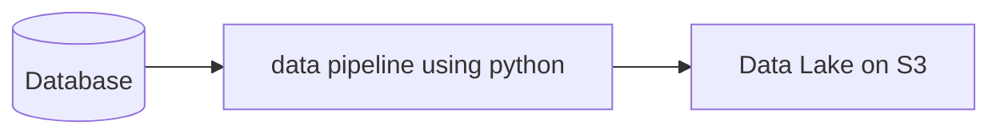

## ABSTRACT.

먼저, 이전 환경에서는 아래와 같은 구성으로 분석환경을 구축해두었습니다.

주로 Python을 이용해 S3로 구축되어 있는 Data Lake 내 파일 단위로 접근해 로컬 환경에서 Python을 이용한 분석 작업이 이루어졌고, 이후 대시보드 등 각각 데이터 활용처에 필요한 형태로 가공하는 것도 Python을 사용해 이루어졌습니다.

그러다 보니, SQL과 점점 멀어지게 되었고 최근 구직활동을 진행하며 다시금 역량을 키워야겠다는 들어 이번 포스트를 통해 기존 작업 진행과 비교해보겠습니다. 또한 분석 프로젝트를 진행하며, 데이터 범위를 User들의 Action log로만 제한해 진행해보려고 합니다.

## INTRODUCTION.

> 아래 데이터는 프로젝트 진행을 위해 임의로 만들어진 데이터입니다.
{: .prompt-info }

|name|dtype|description|
|:---:|:---:|---|
|id|INT||
|user_id|INT|User들의 구분자|
|opening_id|INT|신청 게시글의 구분자|
|action_type|STR|User들의 행동 타입 (booking/selection/cancel 중 택1)|
|date|DATETIME|User의 action log 생성일|

위 데이터는 2017년01월01일 이후부터 지금까지 약 136만 건을 가지고 있습니다. 또한 이 로그는 AS-IS의 환경과는 다소 차이가 있지만, 이번 프로젝트에서 그 부분에 대한 언급은 최소화해 진행하겠습니다.

## WRAP UP
위 데이터를 가지고, EDA부터 Cohort 및 활성유저 수 카운트 등의 분석과 시각화까지의 프로젝트를 AS-IS인 Python을 활용.ver와 TO-BE인 SQL.ver을 모두 진행해보며 비교하는 시리즈를 작성해보려고 합니다. 위 과정들의 내용은 홀로 스터디를 진행하며 작성된 것으로 분명 보안점이나 부족한 부분이 많을 것입니다. 다양한 분들께서 피드백과 배움을 공유해주실 수 있다면, 정말 좋을 것 같습니다.